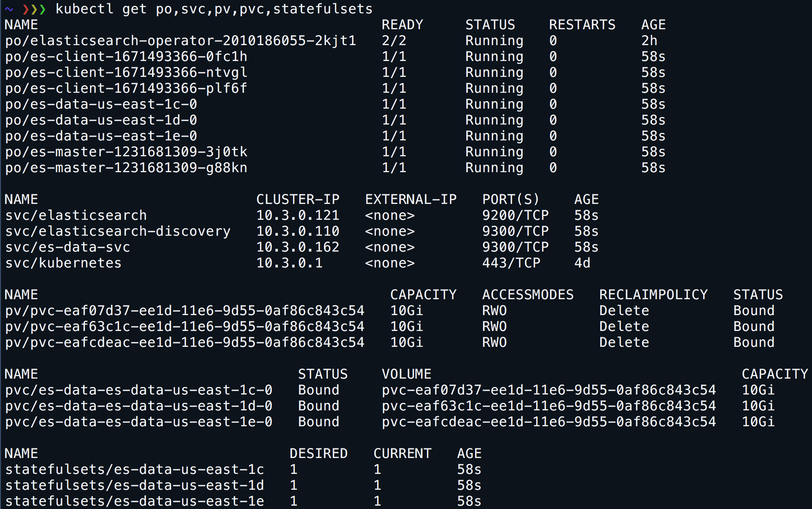

# Elasticsearch operator

[](https://travis-ci.org/upmc-enterprises/elasticsearch-operator)

The ElasticSearch operator is designed to manage one or more elastic search clusters. Included in the project (initially) is the ability to create the Elastic cluster, deploy the `data nodes` across zones in your Kubernetes cluster, and snapshot indexes to AWS S3.

# Requirements

## Kubernetes

The operator was built and tested on a 1.7.X Kubernetes cluster and is the minimum version required due to the operators use of Custom Resource Definitions.

_NOTE: If using on an older cluster, please make sure to use version [v0.0.7](https://github.com/upmc-enterprises/elasticsearch-operator/releases/tag/v0.0.7) which still utilize third party resources._

## Cloud

The operator was also _currently_ designed to leverage [Amazon AWS S3](https://aws.amazon.com/s3/) for snapshot / restore to the  elastic cluster. The goal of this project is to extend to support additional clouds and scenarios to make it fully featured. 

By swapping out the storage types, this can be used in GKE, but snapshots won't work at the moment.

# Demo

Watch a demo here:<br>
[](http://www.youtube.com/watch?v=3HnV7NfgP6A)<br>
[https://www.youtube.com/watch?v=3HnV7NfgP6A](https://www.youtube.com/watch?v=3HnV7NfgP6A)

# Usage

The operator is built using the controller + custom resource definition model. Once the controller is deployed to your cluster, it will automatically create the CustomResourceDefinition (CRD). Next create a Kubernetes object type `elasticsearchCluster` to deploy the elastic cluster based upon the CRD. 

## CustomResourceDefinition

Following parameters are available to customize the elastic cluster:

- client-node-replicas: Number of client node replicas
- master-node-replicas: Number of master node replicas
- data-node-replicas: Number of data node replicas
- zones: Define which zones to deploy data nodes to for high availability (_Note: Zones are evenly distributed based upon number of data-node-replicas defined_)
- data-volume-size: Size of persistent volume to attach to data nodes
- master-volume-size: Size of persistent volume to attach to master nodes
- elastic-search-image: Override the elasticsearch image (e.g. `upmcenterprises/docker-elasticsearch-kubernetes:6.1.3_0`)
- keep-secrets-on-delete (Boolean): Tells the operator to not delete cert secrets when a cluster is deleted
- use-ssl: Use SSL for communication with the cluster and inside the cluster. Default value is true.
- java-options: sets java-options for all nodes
- master-java-options: sets java-options for Master nodes (overrides java-options)
- client-java-options: sets java-options for Client nodes (overrides java-options)
- data-java-options: sets java-options for Data nodes (overrides java-options)
- annotations: list of custom annotations which are applied to the master, data and client nodes
  - `key: value`
- [snapshot](https://www.elastic.co/guide/en/elasticsearch/reference/current/modules-snapshots.html)
  - scheduler-enabled: If the cron scheduler should be running to enable snapshotting
  - bucket-name: Name of S3 bucket to dump snapshots
  - cron-schedule: Cron task definition for intervals to do snapshots
- [storage](https://kubernetes.io/docs/user-guide/persistent-volumes/)
  - Using a provisioner
    - type: Defines the type of storage to provision based upon cloud (e.g. `gp2`)
    - storage-class-provisioner: Defines which type of provisioner to use (e.g. `kubernetes.io/aws-ebs`)
    - encrypted: Whether or not to use encryption. `"true"` or `"false"` Defaults to: `"true"`
  - Using an existing Storage Class (e.g. storage class for GlusterFS)
    - storage-class: Name of an existing StorageClass object to use (zones can be [])
  - Using a custom Storage Class per zone
    - Useful if additional `parameters` are required by provisioner over and above `type` and `storage-class-provisioner`.
    - Manually create a Storage Class per zone. 
    - Storage Class names must match zone names in `zones`. You are free to choose any naming scheme providing they match. Master and Data pod names will include the zone name.
    - Per the `Using a provisioner` section, specify `type:` and `provisioner:` values that match your custom Storage Classes.
  - Omitting the storage section, results in a VolumeClaimTemplates without storage-class annotation (uses default StorageClass in this case. See [change default StorageClass](https://kubernetes.io/docs/tasks/administer-cluster/change-default-storage-class/))
  - volume-reclaim-policy: Define what PV's should use (`Retain` or `Delete`)
- instrumentation
  - statsd-host: Sets the statsd host to send metrics to if enabled
- kibana: Deploy kibana to cluster and automatically reference certs from secret
  - image: Image to use (Note: Using [custom image](https://github.com/upmc-enterprises/kibana-docker) since upstream has x-pack installed and causes issues)
- cerebro: Deploy [cerebro](https://github.com/lmenezes/cerebro) to cluster and automatically reference certs from secret
  - image: Image to use (Note: Using [custom image](https://github.com/upmc-enterprises/cerebro-docker) since upstream has no docker images available)
- nodeSelector: list of k8s NodeSelectors which are applied to the master, data, and client nodes
  - `key: value`
- tolerations: list of k8s Tolerations which are applied to the master, data, and client nodes
  - `- effect:` eg: NoSchedule, NoExecute
    `key:` eg: somekey
    `operator:` eg: exists
- affinity: affinity rules to put on the client node deployments
  - example:

  ```sh
  affinity:
    podAntiAffinity:
      requiredDuringSchedulingIgnoredDuringExecution:
      - labelSelector:
          matchExpressions:
          - key: role
            operator: In
            values:
            - client
        topologyKey: kubernetes.io/hostname
  ```

## Certs secret

The default image used adds TLS to the Elastic cluster. If not existing, secrets are automatically generated by the operator dynamically.

If supplying your own certs, first generate them and add to a secret. Secret should contain `truststore.jks` and `node-keystore.jks`. The name of the secret should follow the pattern: `es-certs-[ClusterName]`. So for example if your cluster is named `example-es-cluster` then the secret should be `es-certs-example-es-cluster`. 

## Base image

The base image used is `upmcenterprises/docker-elasticsearch-kubernetes:6.1.3_0` which can be overridden by adding to the custom cluster you create _(See: [CustomResourceDefinition](#customdesourcedefinition) above)_. 

_NOTE: If no image is specified, the default noted previously is used._

## Image pull secret

If you are using a private repository you can add a pull secret under spec in your ElasticsearchCluster manifest

```sh
spec:
  client-node-replicas: 3
  data-node-replicas: 3
  data-volume-size: 10Gi
  master-volume-size: 10Gi
  java-options: -Xms256m -Xmx256m
  master-node-replicas: 2
  image-pull-secrets:
    - name: pull-secret-name
  snapshot:
    bucket-name: elasticsnapshots99
    cron-schedule: '@every 2m'
    scheduler-enabled: false
  storage:
    storage-class-provisioner: kubernetes.io/aws-ebs
    type: gp2
  zones:
  - us-east-1a
  - us-east-1b
  - us-east-1c
```

# Deploy Operator

To deploy the operator simply deploy to your cluster:

```sh
$ kubectl create ns operator
$ kubectl create -f https://raw.githubusercontent.com/upmc-enterprises/elasticsearch-operator/master/example/controller.yaml -n operator
```

_NOTE: In the example we're putting the operator into the namespace `operator`. If you want to change this, then make sure to update the RBAC rules in the [example/controller.yaml](example/controller.yaml
 ) spec to match the namespace desired._

# Create Example ElasticSearch Cluster

Run the following command to create a [sample cluster](example/example-es-cluster.yaml) on AWS and you most likely will have to update the [zones](example/example-es-cluster.yaml#L16) to match your AWS Account, other examples are available as well if not running on AWS:

```sh
$ kubectl create -n operator -f https://raw.githubusercontent.com/upmc-enterprises/elasticsearch-operator/master/example/example-es-cluster.yaml
```

_NOTE: Creating a custom cluster requires the creation of a CustomResourceDefinition. This happens automatically after the controller is created._

# Create Example ElasticSearch Cluster (Minikube)

To run the operator on minikube, this sample file is setup to do that. It sets lower Java memory constraints as well as uses the default storage class in Minikube which writes to hostPath.

```sh
$ kubectl create -f https://raw.githubusercontent.com/upmc-enterprises/elasticsearch-operator/master/example/example-es-cluster-minikube.yaml
```

_NOTE: Creating a custom cluster requires the creation of a CustomResourceDefinition. This happens automatically after the controller is created._

# Helm

Both operator and cluster can be deployed using Helm charts:

```sh
$ helm repo add es-operator https://raw.githubusercontent.com/upmc-enterprises/elasticsearch-operator/master/charts/
$ helm install --name elasticsearch-operator es-operator/elasticsearch-operator --set rbac.enabled=True --namespace logging
$ helm install --name=elasticsearch es-operator/elasticsearch --set kibana.enabled=True --set cerebro.enabled=True --set zones="{eu-west-1a,eu-west-1b}" --namespace logging
⚡ $helm list
NAME      	              REVISION	UPDATED                 	STATUS  	CHART                       	NAMESPACE
elasticsearch	            1       	Thu Dec  7 11:53:45 2017	DEPLOYED	elasticsearch-0.1.0         	default
elasticsearch-operator  	1       	Thu Dec  7 11:49:13 2017	DEPLOYED	elasticsearch-operator-0.1.0	default
```

# Kibana and cerebro

[Kibana](https://www.elastic.co/products/kibana) and [Cerebro](https://github.com/lmenezes/cerebro) can be automatically deployed by adding the cerebro piece to the manifest:

```sh
spec:
  kibana:
    image: docker.elastic.co/kibana/kibana-oss:6.1.3
  cerebro:
    image: upmcenterprises/cerebro:0.6.8
```

Once added the operator will create certs for Kibana or Cerebro and automatically secure with those certs trusting the same CA used to generate the certs for the Elastic nodes. 

To access, just port-forward to the pod:

```sh
Kibana:
$ kubectl port-forward <podName> 5601:5601
$ curl https://localhost:5601
````

```sh
Cerebro:
$ kubectl port-forward <podName> 9000:9000
$ curl https://localhost:9000
```

_(Note: Using [custom image](https://github.com/upmc-enterprises/kibana-docker) since upstream has x-pack installed and causes issues)_

# Resize ElasticSearch Cluster

If changes are required to the cluster, say the replica count of the data nodes for example, just update the manifest and do a `kubectl apply` on the resource.

# Snapshot

Elasticsearch can snapshot it's indexes for easy backup / recovery of the cluster. Currently there's an integration to Amazon S3 or Google Cloud Storage as the backup repository for snapshots. The `upmcenterprises` docker images include the [S3 Plugin](https://www.elastic.co/guide/en/elasticsearch/plugins/current/repository-s3.html) and the [GCS Plugin](https://www.elastic.co/guide/en/elasticsearch/plugins/current/repository-gcs.html) which enables this feature in AWS and GCP. 

## Schedule

Snapshots can be scheduled via a Cron syntax by defining the cron schedule in your elastic cluster. See: [https://godoc.org/github.com/robfig/cron](https://godoc.org/github.com/robfig/cron)

_NOTE: Be sure to enable the scheduler as well by setting `scheduler-enabled=true`_

## AWS Setup

To enable the snapshots create a bucket in S3, then apply the following IAM permissions to your EC2 instances replacing `{!YOUR_BUCKET!}` with the correct bucket name.

```json
{
    "Statement": [
        {
            "Action": [
                "s3:ListBucket",
                "s3:GetBucketLocation",
                "s3:ListBucketMultipartUploads",
                "s3:ListBucketVersions"
            ],
            "Effect": "Allow",
            "Resource": [
                "arn:aws:s3:::{!YOUR_BUCKET!}"
            ]
        },
        {
            "Action": [
                "s3:GetObject",
                "s3:PutObject",
                "s3:DeleteObject",
                "s3:AbortMultipartUpload",
                "s3:ListMultipartUploadParts"
            ],
            "Effect": "Allow",
            "Resource": [
                "arn:aws:s3:::{!YOUR_BUCKET!}/*"
            ]
        }
    ],
    "Version": "2012-10-17"
}
```

## GCP Setup

To enable snapshots with GCS on GKE, create a bucket in GCS and bind the `storage.admin` role to the cluster service account replacing `${BUCKET}` with your bucket name:

```sh
gsutil mb gs://${BUCKET}

SA_EMAIL=$(kubectl run shell --rm --restart=Never -it --image google/cloud-sdk --command /usr/bin/curl -- -s -H "Metadata-Flavor: Google" http://metadata.google.internal/computeMetadata/v1/instance/service-accounts/default/email)

PROJECT=$(gcloud config get-value project)

gcloud projects add-iam-policy-binding ${PROJECT} \
  --role roles/storage.admin --member serviceAccount:${SA_EMAIL}
```

## Snapshot Authentication

If you are using an elasticsearch image that requires authentication for the snapshot url, you can specify basic auth credentials.

```sh
spec:
  client-node-replicas: 3
  data-node-replicas: 3
  data-volume-size: 10Gi
  master-volume-size: 10Gi
  java-options: -Xms256m -Xmx256m
  master-node-replicas: 2
  snapshot:
    bucket-name: elasticsnapshots99
    cron-schedule: '@every 2m'
    scheduler-enabled: false
    authentication:
     password: betterpasswordneeded
     username: basicauthadmin
  storage:
    storage-class-provisioner: kubernetes.io/aws-ebs
    type: gp2
  zones:
  - us-east-1a
  - us-east-1b
  - us-east-1c
```  

# Access Cluster

Once deployed and all pods are running, the cluster can be accessed internally via https://elasticsearch:9200/ or https://${ELASTICSEARCH_SERVICE_HOST}:9200/. **Note**: the service name for the ES client may also be "elasticsearch + <cluster-Name>" as defined in your `ElasticsearchCluster` resource.



# Development

To run the Operator locally:

```sh
$ mkdir -p /tmp/certs/config && mkdir -p /tmp/certs/certs
$ go get -u github.com/cloudflare/cfssl/cmd/cfssl
$ go get -u github.com/cloudflare/cfssl/cmd/cfssljson
$ go run cmd/operator/main.go --kubecfg-file=${HOME}/.kube/config
```

# About

Built by UPMC Enterprises in Pittsburgh, PA. http://enterprises.upmc.com/
